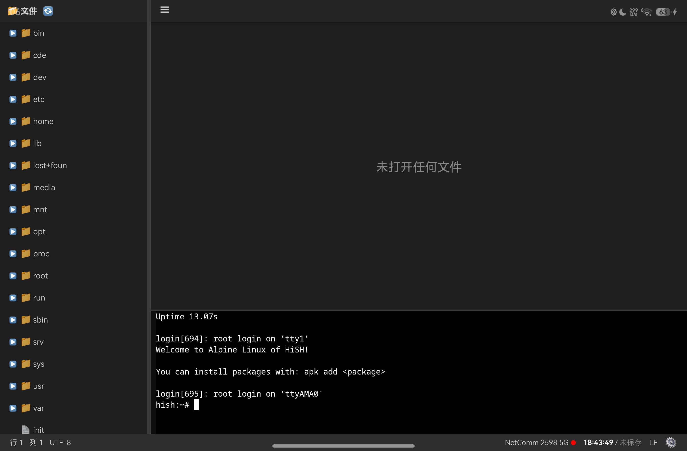

# CodePro

**基于 HiSH 的鸿蒙轻量级代码编辑器**

CodePro 是运行在鸿蒙设备上的集成开发环境（IDE），基于 HiSH（鸿蒙 QEMU 虚拟机管理器）构建。它采用类似 VSCode 的布局，集成了文件管理、代码编辑（Monaco Editor）、终端（WebTerminal）和插件系统，让开发者在平板或大屏设备上直接编写、编译和运行代码。


---

## ✨ 主要功能

- **VSCode 风格界面**：侧边栏、标签页、代码编辑器、终端，支持布局切换（标准/全屏终端）
- **文件树管理**：基于 QEMU 虚拟机内文件系统，支持目录展开/收起、右键新建/删除
- **Monaco Editor 集成**：语法高亮、自动保存、光标位置显示
- **终端集成**：基于 WebTerminal，支持虚拟功能键（ESC、Fn、CTRL 等）
- **端口映射与预览**：自动启动 Python HTTP 服务，一键预览 HTML 文件（含热加载支持）
- **插件系统**：支持自定义插件，内置 HTML 预览插件
- **状态栏信息**：显示行/列、文件路径、WiFi 状态、连接状态、操作进度
- **持久化配置**：布局模式、端口映射等自动保存

---

## 📦 技术栈

- **框架**：ArkTS（鸿蒙 ArkUI）
- **编辑器**：Monaco Editor（通过 WebView 加载）
- **终端**：HiSH 内置的 WebTerminal（基于 xterm.js）
- **后端通信**：QemuAgent（通过 socket 与虚拟机内 QGA 通信）
- **构建工具**：DevEco Studio + hvigor

---

## 🚀 快速开始

### 环境要求

- 鸿蒙设备（平板/2in1）或模拟器
- DevEco Studio 5.0.3.xxx 及以上
- HiSH 已正确配置（虚拟机镜像、QGA 服务）

### 克隆与编译

```bash
git clone https://gitcode.com/myken/codepro
cd codepro
# 使用 DevEco Studio 打开项目，同步依赖，编译运行
```

### 运行

1. 启动 HiSH 虚拟机（确保 QGA 正常运行）
2. 在 DevEco Studio 中点击“运行”按钮，将应用部署到鸿蒙设备
3. 应用启动后自动进入 IDE 布局，连接 QEMU 虚拟机

---

## 📖 使用说明

### 1. 端口映射配置（HTML 预览必需）

在 HiSH 模拟器管理界面中，为当前模拟器添加端口映射，例如：

| 宿主机端口 | 虚拟机端口 |
|------------|------------|
| 8000       | 8000       |

保存并重启模拟器。

### 2. 打开文件并预览 HTML

- 在文件树中导航到 `/home/test.html`（或任何 `.html` 文件）
- 点击文件打开，编辑器显示源码
- 点击标签栏右侧的 **▶（运行）** 按钮
- 插件会自动：
    - 在虚拟机内启动 `python -m http.server 8000`（在文件所在目录）
    - 打开系统浏览器访问 `http://localhost:8000/文件名.html`
- 修改文件后，浏览器会自动刷新（热加载）

### 3. 终端操作

- 标准模式下终端位于编辑器下方，可调整大小
- 点击状态栏 ⚙ 图标可切换至“终端全屏模式”（隐藏侧边栏和编辑器）
- 全屏模式下虚拟功能键（ESC、Fn、CTRL）自动显示

### 4. 插件管理

点击菜单 **📂 文件 → 🔌 插件**，可查看当前已注册的所有插件及其支持的文件类型。

---

## 🔌 插件系统

CodePro 内置了简易插件架构，允许通过实现 `IPlugin` 接口扩展功能。

### 现有插件

| 插件 ID | 名称 | 支持文件 | 功能 |
|---------|------|----------|------|
| `html-preview` | HTML 预览 | `.html`, `.htm` | 自动启动 HTTP 服务，在浏览器中预览 |

### 开发新插件

1. 在 `entry/src/main/ets/plugin/` 下新建类，实现 `IPlugin` 接口
2. 在 `PluginManager.initDefaultPlugins()` 中注册
3. 重启应用即可在“插件管理”中看到新插件

示例：
```typescript
export class MyPlugin implements IPlugin {
  id = 'my-plugin';
  name = '我的插件';
  canHandle(filePath: string): boolean { return filePath.endsWith('.myext'); }
  async activate(context: PluginContext, filePath: string): Promise<void> {
    // 执行自定义逻辑
  }
}
```

---

## ⚙️ 配置

### 运行按钮显示控制

通过 `entry/src/main/resources/rawfile/run_config.json` 控制哪些文件扩展名显示“运行”按钮：

```json
{
  "extensions": [".html", ".htm"]
}
```

### 端口映射默认值

在 `PortMappingService` 中，如果未配置任何端口映射，会自动使用 `{ host: 8000, guest: 8000 }`。

---

## 🧪 故障排除

### 浏览器预览失败（404）

- 确认端口映射已正确配置（宿主机 → 虚拟机）
- 确认 HTTP 服务已启动（插件会自动启动，也可手动运行 `python -m http.server 8000`）
- 检查文件是否在 HTTP 服务根目录下

### 文件树显示为空

- 确认 QEMU 虚拟机已启动且 QGA 服务正常
- 查看日志中是否有 `[QemuCoordinator] ✅ QemuAgent 获取成功`

### 插件未找到

- 确认插件已在 `PluginManager.initDefaultPlugins()` 中注册
- 查看日志 `[PluginManager] 初始化默认插件` 和 `[PluginManager] Plugin registered: ...`

---

## 📂 项目结构（简化）

```
entry/src/main/ets/
├── components/          # UI 组件（FileTree, EditorTabs, WebTerminal...）
├── pages/               # 页面（IDELayout, Index）
├── services/            # 业务服务（端口映射、文件操作、状态栏等）
├── lib/                 # 底层库（QemuAgent, QemuFileSystem）
├── plugin/              # 插件系统（IPlugin, PluginManager, HtmlPreviewPlugin）
└── model/               # 数据模型（Emulator, FileNode...）
```

---

## 🤝 贡献

欢迎提交 Issue 和 Pull Request。请确保代码符合 ArkTS 规范，无 `any`/`unknown` 类型，并通过编译检查。

---

## 📄 许可证

[MIT](LICENSE)

---

> CodePro – 让鸿蒙开发变得更简单。 🚀